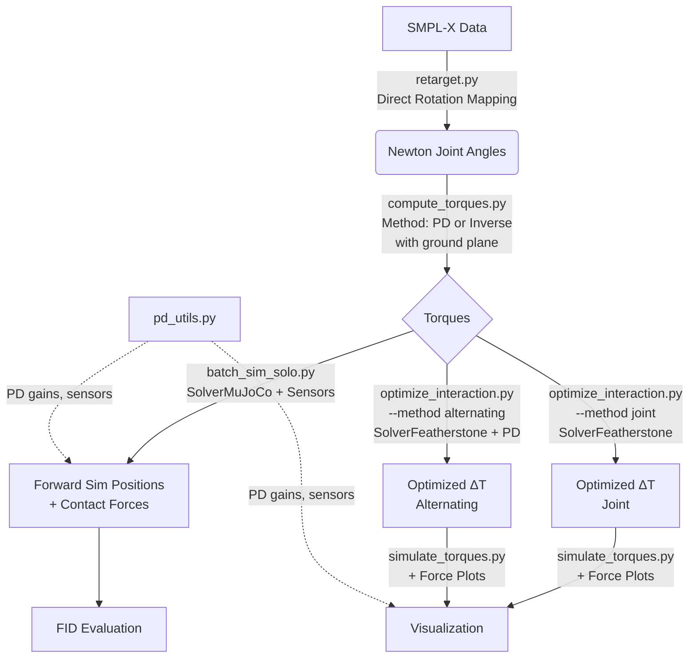
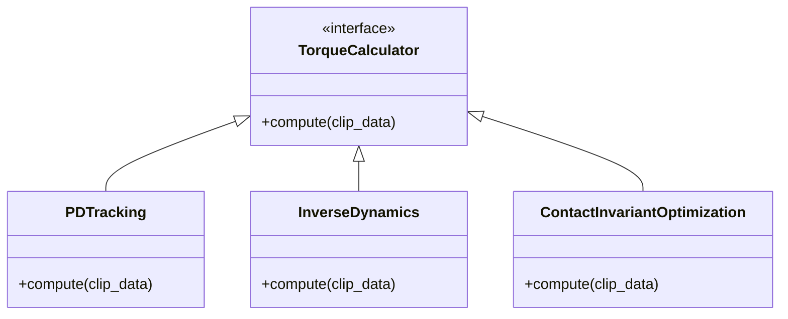
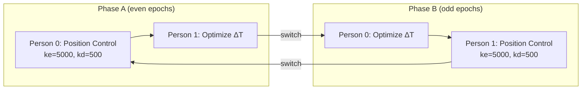

# prepare2/ — Full Physics Simulation & Retargeting Pipeline

This folder contains the complete pipeline for retargeting SMPL-X motions to a physics-based Newton simulation, computing torques, and running forward simulations for evaluation.

## Overview of the Pipeline

The pipeline consists of 7 main steps:



1. **`retarget.py`**: Converts SMPL-X parameters to Newton joint angles (`joint_q`) using **direct rotation mapping** (no IK solver). Generates per-subject XMLs based on body shape (betas).
2. **`compute_torques.py`**: Computes joint torques required to execute the retargeted motions. Supports Inverse Dynamics and PD Tracking (both with ground plane for correct contact forces).
3. **`batch_sim_solo.py`**: Runs a batch forward simulation of the motions using PD tracking to generate kinematic positions for FID evaluation. Records contact forces (GRF + hand) and optionally plots them.
4. **`optimize_interaction.py`**: (Experimental) Optimizes interaction delta torques ($\Delta T$) using differentiable simulation with explicit `CollisionPipeline(requires_grad=False)` for correct rigid contact detection.
5. **`simulate_torques.py`**: Visualizes the simulated motions in the Newton GL viewer with optional real-time contact force plots.
6. **`compute_skyhook_metrics.py`**: Computes per-frame root virtual-force residuals ("skyhook" metric) and per-frame MPJPE for each clip/person, independent of optimization.
7. **`pd_utils.py`**: Centralized PD control utilities — gain tables, torque computation, and contact sensor helpers (`create_contact_sensors`, `update_contact_sensors`).

---

## 1. Retargeting (`retarget.py`)

Converts SMPL-X parameters to Newton joint angles using pure math (direct rotation mapping), achieving **0.00 cm MPJPE** against the source kinematics.

```bash
# Single clip with evaluation (InterHuman)
python prepare2/retarget.py --dataset interhuman --clip 1000 --eval

# Batch all clips
python prepare2/retarget.py --dataset interhuman
```

## 2. Compute Torques (`compute_torques.py`)

Computes the torques needed to drive the physics simulation. This script acts as a unified entry point for different torque calculation methods.



```bash
# Compute PD tracking torques (GPU-accelerated, with ground plane)
python prepare2/compute_torques.py --dataset interhuman --method pd --save --workers 4

# Compute Inverse Dynamics torques (with ground plane for correct GRF)
python prepare2/compute_torques.py --dataset interhuman --method inverse --save
```

> **Note:** Both methods now include a ground plane. Previously, inverse dynamics ran without ground, causing redundant gravity compensation torques that made characters fly when replayed with ground contact. This was fixed so I.D. torques correctly account for ground reaction forces.

## 3. Batch Simulation for Evaluation (`batch_sim_solo.py`)

Runs forward simulation on all clips to generate the `_two_person_sim_positions.npy` files needed for FID evaluation. Uses full PD tracking by default for stability.

```bash
# Process all test-split clips
python prepare2/batch_sim_solo.py --dataset interhuman --split test

# Resume interrupted batch
python prepare2/batch_sim_solo.py --dataset interhuman --split test --resume

# Generate force plots for each clip
python prepare2/batch_sim_solo.py --dataset interhuman --split test --plot-forces
```
*Outputs are saved in a date-stamped folder under `data/batch_sim_solo/`. Per-clip outputs include `_sim_positions.npy`, `_foot_contact_forces.npy`, `_hand_contact_forces.npy`, and optionally `_forces.png`.*

## 4. Interaction Optimization (`optimize_interaction.py`)

Optimizes delta torques ($\Delta T$) to improve physical interaction between two characters using Newton's differentiable `SolverFeatherstone`.

The optimizer uses an explicit `CollisionPipeline(requires_grad=False)` to ensure rigid contact narrow phase runs correctly. While contact detection itself is non-differentiable, the penalty-based contact force computation (`eval_body_contact`) IS differentiable through `wp.Tape`, so gradients still flow through body positions to optimize the interaction torques.

Two optimization methods are available:

### Method: `joint` (default)
Optimizes both persons' $\Delta T$ simultaneously in a single forward pass.

### Method: `alternating`
Alternating coordinate descent — fixes one person with high-gain position control while optimizing the other's torques, then swaps:



The fixed person tracks the reference motion via Newton's built-in PD actuators (hinge DOFs, inside `eval_rigid_tau`) + custom quaternion PD for root DOFs (since FREE joints skip the built-in PD). This produces realistic contact forces that the free person's torques learn to handle.

```bash
# Joint optimization (default, optimize both persons simultaneously)
python prepare2/optimize_interaction.py --clip 1000 --mode optimize

# Alternating optimization (fix one, optimize other, swap)
python prepare2/optimize_interaction.py --clip 1000 --mode optimize \
    --method alternating --phase-epochs 1

# Headless batch
python prepare2/optimize_interaction.py --dataset interhuman --mode optimize \
    --method alternating --epochs 50
```

## 5. Visualization (`simulate_torques.py`)

View the physics simulation in real-time.

```bash
# View PD tracking simulation (default)
python prepare2/simulate_torques.py --clip 1000

# View with real-time contact force plots (GRF + hand contacts)
python prepare2/simulate_torques.py --clip 1000 --plot-forces

# View with precomputed torques from a specific batch run
python prepare2/simulate_torques.py --clip 1000 --torque-dir data/batch_sim_solo/<run_folder>
```

## 6. Skyhook + MPJPE Metrics (`compute_skyhook_metrics.py`)

Computes per-frame root virtual-force residuals (the "skyhook" metric) and per-frame MPJPE for each clip/person.  
This pass is independent of interaction optimization and can run from retargeted `joint_q` files or raw dataset clips.

```bash
# InterHuman (all clips, both persons)
python prepare2/compute_skyhook_metrics.py --dataset interhuman

# Inter-X (all clips, both persons)
python prepare2/compute_skyhook_metrics.py --dataset interx

# Single clip/person smoke test
python prepare2/compute_skyhook_metrics.py \
    --dataset interhuman --clip 1000 --person 0 --max-clips 1
```

Per clip/person output:
- `{clip}_person{i}_skyhook_metrics.npz`: per-frame arrays (`root_force_l2`, `root_torque_l2`, `root_wrench_l2`, `mpjpe_per_frame_m`, `mpjpe_per_joint_m`)
- `{clip}_person{i}_skyhook_metrics.json`: scalar summary for that sequence/person

Run-level output:
- `summary.csv`: one row per processed clip/person
- `summary.json`: aggregate stats (mean residual, mean MPJPE, counts)

---

## Known Limitations & Design Notes

### Physics Solver Trade-offs

1. **Featherstone vs. MuJoCo**: `SolverFeatherstone` is an Articulated Body Algorithm (ABA) solver. In Newton, it is fully differentiable via `wp.Tape`, which is required for backpropagating gradients to optimize interaction torques. It uses penalty-based soft contacts through `eval_body_contact`. `SolverMuJoCo` uses a constraint-based solver (LCP) with hard contacts — robust for forward simulation but non-differentiable.

2. **CollisionPipeline & requires_grad**: Newton's `CollisionPipeline` with `requires_grad=True` **skips rigid contact narrow phase** (those kernels have `enable_backward=False`). For rigid body humanoids, the optimizer uses an explicit `CollisionPipeline(requires_grad=False)` to ensure contact detection runs correctly. The penalty force computation (`eval_body_contact`) IS differentiable even though the detection step is not.

3. **Ground plane**: All torque computation methods (I.D. and PD) now include a ground plane. Previously, I.D. ran without ground, causing the character to "fly" when replayed with ground contact — the I.D. torques included full gravity compensation, which combined with the ground's normal force created a net upward push.

### Contact Sensors

Contact sensors (`SensorContact`) are available only with `SolverMuJoCo` since they require `solver.update_contacts(contacts, state)`. Both `simulate_torques.py` and `batch_sim_solo.py` automatically create sensors for:
- **Foot GRF** (8 groups): Left/Right Ankle + Toe shapes vs ground — measures ground reaction forces
- **Hand contacts** (4 groups): Left/Right Hand shapes vs all other bodies — detects inter-person touch

Sensors gracefully degrade: if Newton's sensor API is unavailable or the solver isn't MuJoCo, sensors are silently skipped.

### Remaining Challenges

- **PD tracking balance**: Pure PD tracking (without feedforward torques or contact-aware optimization) struggles with dynamic balance during walking. The character may stumble at foot contact transitions.
- **Differentiable contacts**: For the optimization step to fully handle ground interaction, a differentiable soft-contact model for the ground is needed (penalty-based contacts through `eval_body_contact` provide partial differentiability).

**Optimization methods**:
- `--method joint` (default): Optimizes both persons' ΔT simultaneously. Simpler gradient landscape but both persons are "soft" during optimization.
- `--method alternating`: Fixes one person with high-gain position control (realistic contact forces), optimizes the other, then swaps. Each person's ΔT is tuned against realistic interaction forces from the counterpart.

**Current Approach**: `batch_sim_solo.py` defaults to `--torque-mode pd` (pure PD tracking with ground), achieving ~17-21cm MPJPE.

## Scripts

### `retarget.py` — Main Retargeting Pipeline

```bash
# Single clip
python prepare2/retarget.py --dataset interhuman --clip 1000

# With per-joint MPJPE evaluation
python prepare2/retarget.py --dataset interhuman --clip 1000 --eval

# Force XML regeneration
python prepare2/retarget.py --dataset interhuman --clip 1000 --clear-cache

# Batch all clips
python prepare2/retarget.py --dataset interhuman

# Inter-X dataset
python prepare2/retarget.py --dataset interx --clip G001T000A000R000
```

**Arguments:**
| Arg | Default | Description |
|-----|---------|-------------|
| `--dataset` | required | `interhuman` or `interx` |
| `--clip` | all | Single clip ID |
| `--eval` | off | Print per-joint MPJPE vs SMPL-X FK |
| `--clear-cache` | off | Delete cached XML for this subject and regenerate |
| `--data_dir` | auto | Dataset root |
| `--output_dir` | `data/retargeted_v2/{dataset}` | Output directory |
| `--gpu` | `cuda:0` | GPU device |

**Output per person:**

| File | Shape | Description |
|------|-------|-------------|
| `{clip}_person{i}.npy` | `(T, 22, 3)` | Joint positions (Newton FK) |
| `{clip}_person{i}_joint_q.npy` | `(T, 76)` | Newton joint coordinates (for playback) |
| `{clip}_person{i}_betas.npy` | `(10,)` | SMPL-X shape parameters |

### `gen_smpl_xml.py` — Per-Subject XML Generator

Generates an MJCF XML with bone lengths matching the given SMPL-X betas.

```python
from prepare2.gen_smpl_xml import generate_smpl_xml

xml_path = generate_smpl_xml(
    betas=np.array([...]),  # (10,) shape params
    output_path="my_subject.xml",
)
```

**How it works:**
1. Runs SMPL-X BodyModel with given betas (zero pose) to get rest-pose joint positions
2. Computes parent→child offsets for each body
3. Transforms offsets to Newton frame via `R_ROT`
4. Clones the template XML tree, updates `<body pos="...">` attributes

### `visualize_newton.py` — Per-Subject Motion Viewer

Plays back retargeted `joint_q` with matching per-subject skeleton.

| Arg | Default | Description |
|-----|---------|-------------|
| `--clip` | `1000` | Clip ID |
| `--person` | both | `0` or `1` |
| `--data-dir` | auto | Directory with retargeted data |
| `--fps` | `20` | Playback FPS |
| `--rest` | off | Show rest pose (T-pose) instead of motion |

### `compute_torques.py` — Headless Torque Computation

Computes torques via inverse dynamics or PD control (no GUI). Both methods include a ground plane for correct contact force handling.

| Arg | Default | Description |
|-----|---------|-------------|
| `--clip` | all | Single clip ID |
| `--dataset` | — | `interhuman` or `interx` (sets `--data-dir` automatically) |
| `--person` | both | Person index (`0` or `1`) |
| `--data-dir` | `data/retargeted_v2/interhuman` | Directory with retargeted data |
| `--output-dir` | auto | Output directory for torques |
| `--method` | `inverse` | `inverse` (analytical I.D.) or `pd` (PD tracking) |
| `--fps` | `30` | Motion FPS |
| `--downsample` | `2` | Downsample loaded data (2 = 60→30fps) |
| `--gain-scale` | `1.0` | Scale factor for PD gains |
| `--save` | off | Save computed torques to file |
| `--force` | off | Overwrite existing torque files |
| `--workers` | `1` | Parallel worker processes |
| `--gpu` | `cuda:0` | GPU device |

### `compute_skyhook_metrics.py` — Per-Frame Skyhook Residual + MPJPE

Computes the root residual force metric from inverse dynamics:

$$
\text{Residual} = \frac{1}{T}\sum_{t=1}^{T}\|F_{root,t}\|_2
$$

where `F_root,t` is the root virtual force vector (DOFs `0:3`) at frame `t`.
Also saves per-frame MPJPE when reference positions are available.

| Arg | Default | Description |
|-----|---------|-------------|
| `--dataset` | required | `interhuman` or `interx` |
| `--input` | `auto` | `retargeted`, `dataset`, or `auto` fallback |
| `--clip` | all | Single clip ID |
| `--person` | both | Person index (`0` or `1`) |
| `--data-dir` | `data/retargeted_v2/{dataset}` | Retargeted input directory |
| `--raw-data-dir` | auto | Raw dataset directory (`data/InterHuman` or `data/Inter-X_Dataset`) |
| `--output-dir` | `data/skyhook_metrics/{dataset}` | Output directory |
| `--fps` | `30` | FPS for inverse dynamics |
| `--downsample` | `2` | Downsample factor (2 = 60→30fps) |
| `--diff-method` | `spline` | Inverse-dynamics differentiation method (`spline` or `fd`) |
| `--max-clips` | all | Process at most N clips |
| `--force` | off | Overwrite existing outputs |
| `--disable-mpjpe` | off | Skip MPJPE and save only skyhook metrics |
| `--gpu` | `cuda:0` | GPU device |

**Per clip/person output files:**
- `{clip}_person{i}_skyhook_metrics.npz`
- `{clip}_person{i}_skyhook_metrics.json`

**Run summary files:**
- `summary.csv`
- `summary.json`
- `config.json`

### `skyhook_debug_clip.py` — Single-Clip Compute + Visualization

Runs a focused debug pass for one clip: tries to compute skyhook metrics, then generates per-frame CSV + diagnostic plots.

```bash
# Compute + visualize clip 1000 into data/test/skyhook
python prepare2/skyhook_debug_clip.py \
    --dataset interhuman --clip 1000 \
    --output-dir data/test/skyhook

# If metrics already exist elsewhere, reuse them and only plot/export CSV
python prepare2/skyhook_debug_clip.py \
    --dataset interhuman --clip 1000 \
    --output-dir data/test/skyhook \
    --source-dir data/skyhook_metrics/interhuman \
    --no-recompute
```

### `visualize_skyhook_mp4.py` — Newton-Like MP4 Debug Video

Renders a single MP4 that combines:
- 3D skeleton playback (Newton-style camera: Z-up, from behind)
- Skyhook residual force `||F_root||` over time (log axis)
- MPJPE over time
- Explicit low-force/high-force callouts (focus person, marked on curve + ghost poses)

```bash
# Render clip 1000 MP4 from existing skyhook metrics
python prepare2/visualize_skyhook_mp4.py \
    --clip 1000 --dataset interhuman \
    --metrics-dir data/test/skyhook \
    --output data/test/skyhook/1000_skyhook_newton_like.mp4

# Prefer exact metric trajectory (joint_q -> FK used by metric pipeline)
python prepare2/visualize_skyhook_mp4.py \
    --clip 1000 --dataset interhuman \
    --metrics-dir data/test/skyhook \
    --retarget-dir data/retargeted_v2/interhuman \
    --prefer-exact \
    --output data/test/skyhook/1000_skyhook_newton_like_exact.mp4
```

Notes:
- `--prefer-exact` tries to reconstruct positions from `joint_q` + FK (same trajectory family as metric computation).
- `--require-exact` makes this strict (fails instead of falling back).
- The script prints `position_source=...` per person so you can verify whether exact FK or fallback positions were used.

### `visualize_skyhook_newton.py` — Newton Viewer (No Matplotlib)

Interactive Newton visualization for the exact skyhook trajectory (single clip/person).
Useful to inspect model state at high-force vs low-force frames directly in Newton.

```bash
# Full playback in Newton viewer
python prepare2/visualize_skyhook_newton.py \
    --dataset interhuman --clip 1000 --person 0 \
    --metrics-dir data/test/skyhook

# Alternate LOW and HIGH force poses in Newton (visual compare)
python prepare2/visualize_skyhook_newton.py \
    --dataset interhuman --clip 1000 --person 0 \
    --metrics-dir data/test/skyhook \
    --mode compare --compare-dwell 45
```

### `simulate_torques.py` — Physics Simulation with PD Tracking

Visualizes PD-controlled simulation tracking the reference motion.
Shows both persons side-by-side by default. Optionally shows real-time contact force plots (GRF + hand contacts) via ImGui overlay.

| Arg | Default | Description |
|-----|---------|-------------|
| `--clip` | `1000` | Clip ID |
| `--person` | both | Person index (omit for both side-by-side) |
| `--data-dir` | `data/retargeted_v2/interhuman` | Directory with joint_q + betas files |
| `--fps` | `30` | Motion FPS |
| `--downsample` | `2` | Downsample loaded data (2 = 60→30fps) |
| `--gain-scale` | `1.0` | Scale factor for PD gains |
| `--torque-mode` | `pd` | `pd`=PD tracking, `solo`=I.D. torques, `full`=solo+ΔT |
| `--torque-dir` | auto | Directory to load precomputed torques from |
| `--annots-dir` | auto | Override annotation directory |
| `--plot-forces` | off | Show real-time contact force plots (GRF + hand contacts) |

### `batch_sim_solo.py` — Batch Forward Simulation

Runs headless forward simulation across all clips for FID evaluation.
Records contact forces and optionally generates matplotlib force plots.

| Arg | Default | Description |
|-----|---------|-------------|
| `--clip` | all | Single clip ID |
| `--dataset` | — | `interhuman` or `interx` |
| `--split` | all | `train`, `val`, or `test` |
| `--data-dir` | `data/retargeted_v2/interhuman` | Input data directory |
| `--fps` | `30` | Data playback FPS |
| `--downsample` | `2` | Downsample loaded data (2 = 60→30fps) |
| `--gain-scale` | `1.0` | PD gain multiplier |
| `--torque-mode` | `pd` | `pd`=full PD tracking, `id+pd`=I.D. + PD correction |
| `--pd-scale` | `1.0` | PD correction scale (for `id+pd` mode) |
| `--output-dir` | auto | Output directory (default: date-stamped) |
| `--gpu` | `cuda:0` | GPU device |
| `--resume` | off | Skip clips with existing output |
| `--force` | off | Overwrite existing output |
| `--skip-torques` | off | Skip clips without pre-computed torques |
| `--max-clips` | all | Process at most N clips (for testing) |
| `--plot-forces` | off | Generate matplotlib PNG of contact forces per clip |

**Per-clip output files:**

| File | Shape | Description |
|------|-------|-------------|
| `{clip}_person{i}_sim_positions.npy` | `(T, 22, 3)` | Simulated joint positions |
| `{clip}_person{i}_foot_contact_forces.npy` | `(T, 8, 3)` | GRF per foot sensor group (8 groups: L/R × Ankle/Toe × ground) |
| `{clip}_person{i}_hand_contact_forces.npy` | `(T, 4, 3)` | Hand contact forces (4 groups: L/R hand vs other bodies) |
| `{clip}_person{i}_forces.png` | — | Contact force plot (if `--plot-forces`) |

### `pd_utils.py` — Centralized PD Utilities

Shared module for PD control and contact sensor management.

**Key functions:**

| Function | Description |
|----------|-------------|
| `compute_pd_torques(model, state, ref_q, ref_qd, gains, ...)` | Compute PD tracking torques for current state |
| `create_contact_sensors(model, solver, n_persons, verbose)` | Create foot GRF + hand contact sensors (MuJoCo only) |
| `update_contact_sensors(solver, state, sensor_dict)` | Step sensors and return `{foot_forces, hand_forces}` arrays |

**Constants:**
- `FOOT_SHAPE_PATTERN = "*Ankle*"` — matches Ankle + Toe shapes (Toe is nested under Ankle in the body hierarchy)
- `HAND_SHAPE_PATTERN = "*Hand*"` — matches L_Hand, R_Hand shapes
- `GROUND_SHAPE_PATTERN = "*ground*"` — matches the ground plane

### `optimize_interaction.py` — Interaction Torque Optimization

Differentiable optimization of delta torques ($\Delta T$) for two-person interaction.
Requires pre-computed solo torques (`_torques_solo.npy`) and reference positions.

| Arg | Default | Description |
|-----|---------|-------------|
| `--clip` | `1000` | Clip ID |
| `--dataset` | — | Process entire dataset (headless) |
| `--data-dir` | `data/retargeted_v2/interhuman` | Data directory with joint_q, betas, torques_solo |
| `--mode` | `optimize` | `forward`=diagnose, `optimize`=train ΔT, `playback`=replay saved ΔT |
| `--method` | `joint` | `joint`=optimize both persons simultaneously, `alternating`=fix one person (position control), optimize other, swap |
| `--fps` | `30` | Data FPS |
| `--downsample` | `2` | Downsample loaded data |
| `--sim-freq` | `480` | Simulation frequency (Hz) |
| `--lr` | `1.0` | Learning rate |
| `--reg-lambda` | `0.01` | L2 regularization weight on ΔT |
| `--window` | `10` | Frames per optimization window |
| `--epochs` | `50` | Full passes (headless only) |
| `--phase-epochs` | `1` | Switch fixed/free every N epochs (alternating only) |
| `--fixed-ke` | `5000` | PD position gain for fixed person's hinges (alternating only) |
| `--fixed-kd` | `500` | PD velocity gain for fixed person's hinges (alternating only) |
| `--fixed-ke-root` | `50000` | PD position gain for fixed person's root (alternating only) |
| `--fixed-kd-root` | `5000` | PD velocity gain for fixed person's root (alternating only) |
| `--force` | off | Overwrite existing outputs |

### `view_template_rest.py` — Template Rest Pose Viewer

View the generic `smpl.xml` template in its rest pose (no args).

### `debug_rest_pose.py` — Rest Pose Debugger

Compare rest pose between the generic template and a per-subject XML. Prints joint position differences.

## Coordinate Transforms

| Transform | Matrix | Purpose |
|-----------|--------|---------|
| `R_ROT` | `[[0,0,1],[1,0,0],[0,1,0]]` | SMPL-X body-local → Newton body-local frame (body offsets, rotation conjugation) |

**Position mapping:** Direct (no rotation). InterHuman data is in Z-up world frame (root_orient encodes SMPL-X Y-up → Z-up). Newton uses `up_axis=Z`, so world frames match.

### Root Orientation Formula

```
R_root_newton = R(root_orient) @ R_ROT^T
```

`R(root_orient)` maps from SMPL-X body-local (Y-up) to Z-up world. `R_ROT^T` maps from Newton body-local back to SMPL-X body-local (inverse of R_ROT).

### Body Joint Formula

```
R_hinge = R_ROT @ R_smplx_joint @ R_ROT.T    (standard conjugation)
euler = decompose(R_hinge, extrinsic 'XYZ')   (Newton D6 composition order)
```

## Newton joint_q Format (76 values)

```
[0:3]   = Root position:     tx, ty, tz
[3:7]   = Root quaternion:   qx, qy, qz, qw   (xyzw format, NOT wxyz)
[7:10]  = L_Hip euler:       θx, θy, θz        (extrinsic XYZ)
[10:13] = L_Knee euler:      θx, θy, θz
...     (DFS body order, 3 DOF per non-root body)
[73:76] = R_Hand euler:      θx, θy, θz
```

**Index formula:** For Newton body `b` (1-23): `q_start = 7 + (b - 1) * 3`

## XML Cache

Per-subject XMLs are cached in `prepare2/xml_cache/` by a hash of the betas array. Two people with identical betas reuse the same XML.

## Visualization

### Per-subject Newton viewer (recommended)

Plays back `joint_q` directly with per-subject skeleton — no IK, no bone-length mismatch:

```bash
# Both persons side-by-side
python prepare2/visualize_newton.py --clip 1000

# Single person
python prepare2/visualize_newton.py --clip 1000 --person 0

# Rest pose (T-pose with per-subject skeleton)
python prepare2/visualize_newton.py --clip 1000 --rest

# Custom data/FPS
python prepare2/visualize_newton.py --clip 1000 \
    --data-dir data/retargeted_v2/interhuman --fps 30

# Inter-X clip
python prepare2/visualize_newton.py --clip G001T000A000R000 \
    --data-dir data/retargeted_v2/interx
```

### Physics simulation & torques

```bash
# Compute torques (headless) — inverse dynamics or PD control
python prepare2/compute_torques.py --clip 1000 --person 0
python prepare2/compute_torques.py --clip 1000 --method pd --gain-scale 2.0 --save

# Simulate with PD tracking (visual) — both persons side-by-side
python prepare2/simulate_torques.py --clip 1000
python prepare2/simulate_torques.py --clip 1000 --person 0  # single person
python prepare2/simulate_torques.py --clip 1000 --gain-scale 0.5 --fps 30

# Visualize precomputed inverse dynamics torques
python prepare2/simulate_torques.py --clip 1000 --torque-mode solo \
    --torque-dir data/compute_torques/interhuman

# Simulate with real-time contact force plots
python prepare2/simulate_torques.py --clip 1000 --plot-forces

# Batch simulation with force recording and plots
python prepare2/batch_sim_solo.py --clip 1000 --plot-forces
python prepare2/batch_sim_solo.py --dataset interhuman --split test --plot-forces

# Interaction optimization (joint method)
python prepare2/optimize_interaction.py --clip 1000 --mode optimize

# Interaction optimization (alternating method)
python prepare2/optimize_interaction.py --clip 1000 --mode optimize \
    --method alternating --phase-epochs 1
```

### Debug / inspection utilities

```bash
# View template XML rest pose (generic smpl.xml)
python prepare2/view_template_rest.py

# Debug rest pose comparison (template vs per-subject)
python prepare2/debug_rest_pose.py
```

### Other visualization

The `(T, 22, 3)` position .npy files are also compatible with `prepare/` visualization scripts:

```bash
# Matplotlib 3D skeleton animation
python prepare/visualize_positions.py --clip 1000 \
    --data-dir data/retargeted_v2/interhuman

# Newton viewer with full SMPL-X mesh (loads directly from dataset)
python prepare/visualize_mesh_newton.py --clip 1000 --fps 30
```

## SMPL-X ↔ Newton Body Mapping

24 Newton bodies (DFS order from XML), 22 SMPL-X joints:

| Newton Body | Index | SMPL-X Joint | Index |
|-------------|-------|-------------|-------|
| Pelvis | 0 | Pelvis | 0 |
| L_Hip | 1 | L_Hip | 1 |
| L_Knee | 2 | L_Knee | 4 |
| L_Ankle | 3 | L_Ankle | 7 |
| L_Toe | 4 | L_Foot | 10 |
| R_Hip | 5 | R_Hip | 2 |
| R_Knee | 6 | R_Knee | 5 |
| R_Ankle | 7 | R_Ankle | 8 |
| R_Toe | 8 | R_Foot | 11 |
| Torso | 9 | Spine1 | 3 |
| Spine | 10 | Spine2 | 6 |
| Chest | 11 | Spine3 | 9 |
| Neck | 12 | Neck | 12 |
| Head | 13 | Head | 15 |
| L_Thorax | 14 | L_Collar | 13 |
| L_Shoulder | 15 | L_Shoulder | 16 |
| L_Elbow | 16 | L_Elbow | 18 |
| L_Wrist | 17 | L_Wrist | 20 |
| **L_Hand** | **18** | — | — |
| R_Thorax | 19 | R_Collar | 14 |
| R_Shoulder | 20 | R_Shoulder | 17 |
| R_Elbow | 21 | R_Elbow | 19 |
| R_Wrist | 22 | R_Wrist | 21 |
| **R_Hand** | **23** | — | — |

L_Hand and R_Hand have no SMPL-X equivalent — their Euler angles remain at 0.
